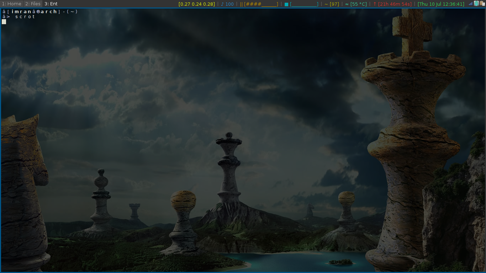

i3-config
==========

 
(note: I rarely have floating windows besides popups/save dialogs etcetera. This window is floating to show my wallpaper and also to show window borders)

These configuration files are for the popular X11 tilling window manager, i3. 

Files
-----

* .i3/config - the main i3 config file containing key bindings and colours for windows.
* .i3/conkyrc - the conky config for i3status.
* .scripts/touchpadOff.sh- so that I don't have to keep turning off my annoying touchpad on startup. Not necessarily needed for all setups.
* .i3/conky - some meta stuff.

Installation
------------

If you'd like to install this, clone the repo and move everything to the appropriate places. Make sure you have everything that's needed installed.

My own .xinitrc file contains simply "exec i3". 

Make sure feh is installed and set your wallpaper for the first time with "feh --bg-fill /path/to/file". This will create ~/.fehbg which i3 will run upon startup. .fehbg will automatically update whenever you run feh to change the wallpaper again.

Credits
-------

This repo was forked from [here](https://github.com/NorthAntrim/i3-config) who apparently forked it from [here](https://github.com/ivyl/i3-config).

Other
-----

That's all. Hopefully I didn't miss anything! If you try this out and it doesn't look like the example above, something's maybe not installed, needs customized for your system or I forgot to include a file (in which case, create a new issue).
